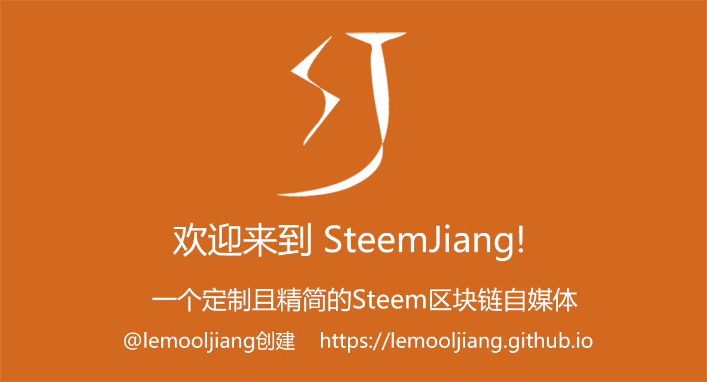

# SteemJiang

SteemJiang是一个定制且精简的Steem区块链自媒体，@lemooljiang创建。它做了很多的前端优化，使用起来相当丝滑！

SteemJiang是一个**纯粹的前端应用！** 它和比特币的离线钱包类似，可以很方便地在本地构建，无需服务器。

当然，为了方便大家使用，我把它上传到github page中，大家可以直接访问：https://lemooljiang.github.io

## 本地构建说明
本地环境：Apache 或 Nginx

将仓库中的“index.html” 和 “static” 下载到本地，放进Apache 或 Nginx的根目录即可，http://localhost
